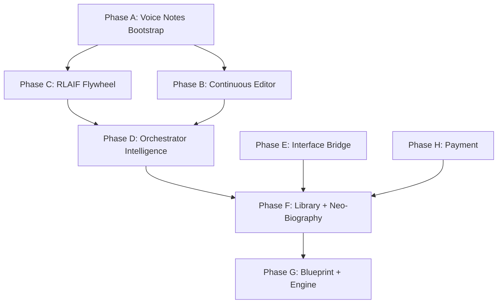

# Alexandria Execution Plan

> Created by Opus 4.5+ planning session, 2026-02-21.
> Based on complete reading of ALEXANDRIA.md (886 lines), MOWINCKEL.md, CTO_LOG.md, and full codebase exploration.
> This document organizes all work by required model capability (Tier 1/2/3) so cheaper models can execute the majority while expensive models handle architectural decisions and verification.

---

## Architecture Reconciliation

**The new ALEXANDRIA.md changes the component model.** This must be understood before any work begins.

### Old Vision (4 Components)
Constitution + PLM + Memories (graph database) + Vault

### New Vision (3 Persistent Components)
Constitution + PLM + Vault

**What happened to Memories?** They are no longer a separate component. The Vault stores all raw data. The Orchestrator manages **working memory** as an active process during each interaction (analogous to dorsolateral prefrontal cortex) — it exists during an interaction and dissolves after. It is not a stored component.

**Impact on existing codebase:**
- `memory_fragments` table (pgvector) **stays** — it's a search index over Vault data, not a separate component. The Orchestrator uses it to find relevant context. Rename conceptually from "Memories component" to "Vault search index."
- `memory_entities` / graph database plans from CTO_LOG Phase D — **deprioritized**. The new vision doesn't include a graph Memories component. Entity extraction may have utility later as a derived view, but it's not Ad Terminum.
- `entries` table **stays** — raw conversation storage, part of the Vault.
- Supabase Storage **stays as bridge** — the Terminal Vault is local files (iCloud/Files), but Supabase Storage works for now.

### Other Architectural Shifts

| Shift | Old | New | Codebase Impact |
|-------|-----|-----|-----------------|
| Vault hosting | Alexandria hosts on Supabase | Vault is a local folder spec, Author's own storage | Supabase Storage is a valid bridge. No immediate change needed. |
| Interface | Web app + future iOS app | iMessage-first, no app. Web dashboard for management. | Current web chat is a valid bridge. iMessage bridge is a later phase. |
| Library | Optional marketplace | Mandatory for all Personas (Axiom) | Needs to be built, but not urgent. |
| Blueprint | Configuration file | Full code editing capability within Axioms | Major infrastructure — Phase G. |
| Editor personality | Professional biographer | Engagement-optimized (humor, haggling, games) | Affects Editor system prompt and behavior. Phase B. |
| Privacy | Basic filtering | Three modes (Private/Personal/Professional) + autonomy dial | Orchestrator upgrade. Phase D. |
| Persona count | One per Author | Natural Persona (one per Author) + Synthetic Personas | Affects data model. Later phase. |
| Neo-Biography | N/A | Multimedia canvas with authored works + curated influences | Major new feature. Phase F. |

---

## Tiering Principles

### Tier 1: Straightforward (Mid-Tier Models)
Tasks where the pattern already exists in the codebase and the new work follows it mechanically. Database migrations following existing schema conventions. API endpoints mirroring existing route patterns. UI adjustments. Configuration changes. File utilities.

**How to delegate:** Describe the existing pattern (quote the file), describe what needs to change, provide the specific file paths. The model executes by pattern-matching.

### Tier 2: Complex (Opus-Class Models)
Tasks requiring architectural decisions, novel patterns, multi-system integration, careful edge-case handling, or deep understanding of the Alexandria vision. If getting it wrong means rebuilding, it's Tier 2.

**How to delegate:** Don't. These tasks require the expensive model. Run them directly.

### Tier 3: Verification (Opus-Class Models)
Review gates. After a phase's Tier 1 tasks are complete, Opus verifies: Axiom compliance, Terminal alignment, code quality, functional correctness.

**How to run:** Opus reads the changes, runs verification commands, checks against ALEXANDRIA.md, approves or flags issues.

---

## Phase A: Voice Notes Bootstrap

**Priority:** IMMEDIATE — highest-signal data available. Unlocks Constitution extraction and first real PLM training.

**Goal:** Process 100 hours of founder voice memos into the Vault. Extract Constitution. Generate training pairs. Train first real PLM.

**Current state:** Voice processor exists (`lib/modules/voice/processor.ts`), Whisper integration works, `app/api/voice-bootstrap/route.ts` exists, `app/api/upload-carbon/route.ts` handles file uploads, processing queue exists.

### Tier 1 Tasks

**A1. Batch upload pipeline** — Extend `app/api/voice-bootstrap/route.ts` to accept a directory path or list of file URLs and create processing jobs for each. The existing `processing_jobs` table and `app/api/process-queue/route.ts` already handle async job processing. Follow the existing pattern in `upload-carbon/route.ts`.

Files: `app/api/voice-bootstrap/route.ts`, `app/api/process-queue/route.ts`
Pattern: Look at how `upload-carbon` creates processing jobs and `process-queue` executes them.

**A2. Progress dashboard** — Add a simple UI component showing processing progress (jobs completed / total, current file, estimated time). Query the `processing_jobs` table. Follow the pattern in `ConstitutionPanel.tsx`.

Files: New component `app/components/VoiceBootstrapProgress.tsx`, wire into `app/page.tsx`
Pattern: Follow `ConstitutionPanel.tsx` structure.

**A3. Vault file tracking** — Ensure every processed voice note creates a `vault_files` entry with correct metadata. The table exists (migration 00013). The utility exists (`lib/utils/vault.ts`). Just verify the pipeline creates entries consistently.

Files: `lib/utils/vault.ts`, `lib/modules/voice/processor.ts`

**A4. Transcription storage** — Store transcriptions as both `entries` (for search indexing) and as text files in Supabase Storage (for Vault preservation of the derived view). Currently transcriptions go into `entries` but the raw transcript file may not be stored separately.

Files: `lib/modules/voice/processor.ts`, `lib/utils/vault.ts`

### Tier 2 Tasks

**A5. Temporal clustering strategy** — 100 hours of voice memos span potentially years. Need a strategy for grouping related memos by topic and timeframe so that Constitution extraction can process coherent thematic clusters rather than random individual transcripts. This affects extraction quality significantly.

Decision: How to cluster? By date? By detected topic? By semantic similarity? How does this feed into Constitution extraction?

**A6. Constitution extraction from voice corpus** — The Constitution structure in the new vision has five sections: Worldview, Values, Models, Identity, Shadows. Current `ConstitutionManager.extract()` exists but was designed for conversational data, not bulk voice transcripts. Need to adapt the extraction logic for stream-of-consciousness voice data where the Author is thinking aloud, not answering structured questions.

Files: `lib/modules/constitution/manager.ts`
Decision: How to extract Constitution sections from unstructured voice monologues? Multi-pass extraction? Topic detection first?

**A7. Training pair quality for voice-derived data** — Voice transcripts have different characteristics than chat conversations (more rambling, more self-correction, more thinking-aloud). Need to assess whether the existing training pair generation (`GroqRefiner` in `lib/modules/subjective/refiner.ts`) handles this well or needs adaptation.

Files: `lib/modules/subjective/refiner.ts`

### Tier 3 Verification

After Phase A Tier 1+2 complete:
- [ ] Verify: All 100 hours processed, stored in Vault, entries created
- [ ] Verify: Constitution extracted with meaningful content in all five sections
- [ ] Verify: Training pairs generated with quality scores > 0.7 on average
- [ ] Verify: `GET /api/debug/state` shows increased counts
- [ ] Check: Does the extracted Constitution actually reflect the founder's worldview? (Requires founder review)
- [ ] Check: Are training pairs from voice memos suitable for PLM fine-tuning?

---

## Phase B: Continuous Editor Agent

**Priority:** HIGH — The Editor being always-on is what makes Alexandria a Machine, not an app.

**Goal:** Transform the Editor from reactive (responds when Author messages) to continuous (always-alive agent loop that decides when to act).

**Current state:** Editor is reactive only — `editor.converse()` is called by `app/api/input-chat/route.ts` when the Author sends a message. No background loop, no proactive messaging, no smart sleep.

**Infrastructure:** Vercel Pro is active — cron jobs available (up to 300s function timeout).

### Tier 1 Tasks

**B1. Cron endpoint** — Create `app/api/cron/editor-cycle/route.ts`. A Vercel Cron-triggered endpoint that runs the Editor's autonomous cycle. Follow existing API route patterns. Should be simple: authenticate cron request, call the Editor cycle function, return status.

Files: New `app/api/cron/editor-cycle/route.ts`, add to `vercel.json` cron config.
Pattern: Follow existing route patterns. Vercel Cron docs for authentication.

**B2. Editor state table** — Migration for `editor_state` table tracking: `user_id`, `last_cycle_at`, `last_contact_at`, `activity_level` (high/medium/low), `sleep_duration_minutes`, `next_cycle_at`, `cycle_count`.

Files: New migration `supabase/migrations/00016_editor_state.sql`
Pattern: Follow existing migration patterns (00014, 00015).

**B3. Message queue table** — Migration for `editor_messages` table: `id`, `user_id`, `content`, `message_type` (proactive_question / gap_alert / contradiction_alert / feedback_request), `priority`, `delivered`, `delivered_at`, `created_at`. This is where the Editor queues proactive messages for the Author.

Files: New migration `supabase/migrations/00017_editor_messages.sql`

**B4. Message delivery endpoint** — `GET /api/editor-messages` returns undelivered messages for a user. The web UI polls this and displays proactive messages. Later, these messages route to iMessage.

Files: New `app/api/editor-messages/route.ts`

**B5. Proactive message UI** — Display queued Editor messages in the chat interface. Show as a notification or inline message. The Author can respond, which triggers normal `input-chat` flow.

Files: `app/page.tsx`, `app/components/` (new component or extend existing chat)

### Tier 2 Tasks

**B6. Editor agent loop architecture** — The core logic. This is the hardest part of Phase B. The Editor's cycle needs to:
1. Check for new data (entries since last cycle, new vault files, etc.)
2. Analyze state (Constitution gaps, contradictions, training opportunities)
3. Decide action (proactive message? background maintenance? sleep?)
4. Execute action
5. Calculate smart sleep duration (1-30 minutes based on activity)
6. Schedule next cycle

This requires careful design of the decision logic, the state analysis, and the sleep calculation. The existing `editor.converse()` handles reactive conversation but there's no autonomous decision-making loop.

Files: New method on `Editor` class (or new class `EditorAgent`), referenced by cron endpoint.
Decision: How does the agent decide between "send proactive message" and "do background work"? What signals drive the decision? How is sleep duration calculated?

**B7. Constitution gap detection** — The Editor needs to analyze the Constitution and identify sections with low coverage. This means: parse Constitution markdown, identify which sections exist, query training pairs to see which sections are well-represented, calculate gap scores.

Files: `lib/modules/constitution/manager.ts` (add gap analysis method)
Decision: How to define "coverage"? Training pair count per section? RLAIF score per section? Combination?

**B8. Contradiction detection** — Compare stated values in Constitution with observed behavior in conversation history. Flag when the Author says one thing but does another. This is the "Shadows" section of the new Constitution structure.

Decision: What counts as a contradiction? How to avoid false positives? How to surface this sensitively?

**B9. Editor personality calibration** — The new vision emphasizes that the Editor must be engaging, funny, calibrated to the specific Author. The current Editor system prompt is professional and neutral. Need to design how the Editor develops a personality that matches the Author's sensibility.

Decision: How does the Editor calibrate humor and style? From Constitution? From observed Author responses? Iteratively?

### Tier 3 Verification

- [ ] Verify: Cron job triggers on schedule, Editor cycle runs
- [ ] Verify: Editor correctly identifies when to message vs do background work
- [ ] Verify: Proactive messages appear in UI
- [ ] Verify: Smart sleep adjusts duration based on activity
- [ ] Verify: Constitution gap detection finds actual gaps
- [ ] Test: Introduce a Constitution gap → Editor detects it → queues proactive message
- [ ] Check: Does the Editor's decision logic align with the ALEXANDRIA.md Editor spec?

---

## Phase C: Constitutional RLAIF Flywheel

**Priority:** HIGH — The compounding engine. Each cycle improves training data quality.

**Goal:** Implement the full RLAIF loop: Gap identification → Synthetic prompt generation → PLM response → Constitutional evaluation → Confidence routing → Batch training → Iterate.

**Current state:** Basic RLAIF exists (`lib/modules/migration/rlaif-amplifier.ts`, `app/api/rlaif/route.ts`). Generates synthetic ratings. But no gap identification, no targeted prompts, no confidence routing, no iterative loop.

### Tier 1 Tasks

**C1. Constitution gaps table** — Migration for `constitution_gaps`: `id`, `user_id`, `section` (worldview/values/models/identity/shadows), `subsection`, `priority`, `training_pair_count`, `avg_quality_score`, `last_evaluated`, `created_at`. Note: section names match the new 5-section Constitution structure from ALEXANDRIA.md.

Files: New migration `supabase/migrations/00018_constitution_gaps.sql`

**C2. PLM maturity table** — Migration for `plm_maturity`: `user_id`, `overall_score`, `domain_scores` (JSONB — disaggregated by Constitution section), `training_pair_count`, `rlaif_evaluation_count`, `last_training_at`, `updated_at`.

Files: New migration `supabase/migrations/00019_plm_maturity.sql`

**C3. RLAIF evaluation results table** — Migration for `rlaif_evaluations`: `id`, `user_id`, `prompt`, `plm_response`, `constitution_section`, `scores` (JSONB — values_alignment, model_usage, heuristic_following, style_match), `overall_confidence`, `routing` (auto_approved / author_review / flagged), `author_verdict` (nullable), `created_at`.

Files: New migration `supabase/migrations/00020_rlaif_evaluations.sql`

**C4. Author review queue UI** — Display medium-confidence training pairs to the Author for validation. Show: the prompt, the PLM's response, the evaluator's reasoning. Author approves or corrects. Follow existing feedback UI patterns.

Files: New component, new API endpoint `app/api/rlaif/review/route.ts`

### Tier 2 Tasks

**C5. Gap identification algorithm** — Parse Constitution, analyze training pair coverage per section, prioritize gaps. The new Constitution has 5 sections (Worldview, Values, Models, Identity, Shadows). Values gaps are highest priority per ALEXANDRIA.md.

Files: New module or extend `lib/modules/constitution/manager.ts`
Decision: How to measure coverage? How to weight sections? How to update gaps as training pairs accumulate?

**C6. Synthetic prompt generation** — Generate realistic prompts that test specific Constitution sections. If the Constitution says "I never compromise on intellectual honesty even when it's socially costly," generate a scenario where honesty conflicts with social comfort. Quality of synthetic prompts directly determines RLAIF quality.

Files: New module `lib/modules/rlaif/prompt-generator.ts` (or extend existing)
Decision: What makes a good synthetic prompt? How many per gap? How to avoid repetitive scenarios?

**C7. Constitutional evaluation scoring** — LLM-as-judge: compare PLM response to relevant Constitution sections. Score along multiple dimensions. All scores disaggregated by Constitution section and domain. The rubric design is critical.

Files: New module `lib/modules/rlaif/evaluator.ts`
Decision: Scoring dimensions, thresholds, how to combine scores, how to detect genuine misalignment vs stylistic variation.

**C8. Confidence routing logic** — High confidence (above threshold) → auto-approve + add to training pairs. Medium → queue for Author review. Low → flag contradiction + ask Author. The threshold values and routing logic need careful design.

Decision: What thresholds? How do thresholds adapt as PLM matures?

**C9. Automated batch training trigger** — When enough high-quality pairs accumulate (threshold), auto-push to Fireworks AI for LoRA fine-tuning (Kimi K2.5 base). Version new weights. Update PLM maturity scores.

Files: Extend `lib/modules/subjective/tuner.ts`, `lib/modules/training/training-assessor.ts`
Decision: How many pairs trigger a batch? Quality threshold? How to version weights?

### Tier 3 Verification

- [ ] Verify: Full loop works end-to-end (gap → prompt → PLM response → evaluation → routing → training)
- [ ] Verify: Gap identification accurately reflects Constitution coverage
- [ ] Verify: Synthetic prompts actually test the targeted Constitution section
- [ ] Verify: Evaluation scores correlate with actual quality (not just noise)
- [ ] Verify: Confidence routing produces correct decisions (sample check)
- [ ] Verify: Each training batch improves PLM (RLAIF scores increase)
- [ ] Check: Does the RLAIF loop match ALEXANDRIA.md specification?

---

## Phase D: Orchestrator Intelligence

**Priority:** MEDIUM — Makes the Persona actually useful. Depends on PLM maturity data from Phase C.

**Goal:** Dynamic component weighting, privacy modes, working memory management.

**Current state:** Orchestrator exists with fixed approach — queries PLM + memories + Constitution but without dynamic weighting or privacy filtering.

### Tier 1 Tasks

**D1. Privacy modes table** — Migration for `privacy_settings`: `user_id`, `default_mode` (private/personal/professional), `contact_modes` (JSONB mapping contact IDs to modes), `sensitive_sections` (JSONB — Constitution sections restricted beyond their mode), `autonomy_level` (low/medium/high), `updated_at`.

Files: New migration `supabase/migrations/00021_privacy_settings.sql`

**D2. Privacy settings API** — CRUD endpoints for privacy configuration.

Files: New `app/api/privacy/route.ts`

**D3. Activity log table** — Migration for `persona_activity`: `id`, `user_id`, `action_type`, `summary`, `details` (JSONB), `requires_attention`, `created_at`.

Files: New migration

### Tier 2 Tasks

**D4. Dynamic weighting logic** — The Orchestrator needs to calculate per-query weights across Constitution, PLM, and Vault based on: PLM maturity in the relevant domain (from `plm_maturity` table), query type (values/facts/reasoning/prediction/novel), and Blueprint rules. Early stage: Constitution ~80%, PLM ~20%. Mature: Constitution ~20%, PLM ~80%.

Files: `lib/modules/core/orchestrator.ts`
Decision: How to classify query type? How to map PLM domain scores to weights? How to handle mixed-domain queries?

**D5. Privacy filtering** — Orchestrator must filter responses based on the querier's assigned privacy mode. Never expose Constitution text or PLM weights in outputs. Synthesize responses without revealing internals.

Files: `lib/modules/core/orchestrator.ts`
Decision: How to implement filtering without crippling response quality? What are the specific rules per mode?

**D6. Working memory** — The Orchestrator manages active context during each interaction. Currently this is just conversation history. Needs to be more intelligent: track what was discussed, what the querier cares about, what information was already provided.

Decision: How sophisticated does working memory need to be initially? Simple conversation buffer vs active context management?

### Tier 3 Verification

- [ ] Verify: Weighting shifts as PLM maturity changes
- [ ] Verify: Values questions always favor Constitution regardless of maturity
- [ ] Verify: Privacy modes correctly filter sensitive content
- [ ] Verify: Working memory maintains coherent context across long interactions
- [ ] Check: Does Orchestrator behavior match ALEXANDRIA.md specification?

---

## Phase E: Interface Bridge

**Priority:** MEDIUM-LOW near-term, HIGH for Terminal. Current web chat works as bridge.

**Goal:** Get the product into iMessage (Terminal interface). In the interim, improve the web chat bridge.

**Current state:** Web chat UI works. No iMessage integration. Telegram was built and archived.

**ALEXANDRIA.md is explicit:** "Alexandria does not have an app. The product is a conversation. The interface is iMessage." But it also says: "A Telegram bot or web chat interface if the iMessage bridge is not yet ready."

### Tier 1 Tasks

**E1. Research iMessage bridge options** — Investigate: Apple Messages for Business, Twilio phone number (SMS→iMessage when both parties have iPhone), third-party services. Document findings, costs, constraints, and recommended approach.

Output: Written research document.

**E2. Improve web chat bridge** — The web chat is the current interface. Improve it: add proactive message display (from Phase B4), add typing indicators, add file upload improvements, add Constitution panel polish.

Files: `app/page.tsx`, `app/components/`

### Tier 2 Tasks

**E3. iMessage bridge architecture** — Based on E1 research, design the iMessage integration. This is a significant integration with Apple's ecosystem. Needs to handle: text, audio messages, voice memo forwarding, file sharing, eventually calls.

Decision: Which iMessage approach? Apple Business Chat vs Twilio vs other? How to handle media types? How to route messages to Editor vs Orchestrator (separate contacts)?

**E4. Onboarding flow** — The new vision describes Poke-style onboarding: link → iMessage opens → Editor responds with personality → price haggling → web form → back to iMessage. This is a conversion-critical flow that requires careful design.

Decision: How does the Editor demonstrate it already knows about the Author? How does price haggling work technically? What data does the web form collect?

### Tier 3 Verification

- [ ] Verify: Messages route correctly to Editor/Orchestrator
- [ ] Verify: Media handling works (voice notes, photos, documents)
- [ ] Verify: Onboarding conversion flow is smooth (test with real user)
- [ ] Check: Does the experience feel like texting a person, not using a product?

---

## Phase F: Library + Neo-Biography

**Priority:** MEDIUM — This is where network effects live. Start simple, expand.

**Goal:** Build the Library (marketplace of Personas) and Neo-Biography (multimedia canvas per Persona).

**Current state:** Nothing exists. No Library, no Neo-Biography, no Persona API.

### Tier 1 Tasks

**F1. Persona API endpoint** — `POST /api/persona/query` — External callers query a Persona. Orchestrator handles the response. Authentication via API key. Follow existing API patterns.

Files: New `app/api/persona/query/route.ts`, new migration for `api_keys` and `api_usage` tables.

**F2. API key management** — Generate, list, revoke API keys per user. Simple CRUD.

Files: New `app/api/keys/route.ts`

**F3. Library listing page** — Simple web page listing all Personas with basic info. MVP: name, short bio, link to Neo-Biography.

Files: New `app/library/page.tsx`

**F4. Neo-Biography page** — Per-Persona page displaying: authored works (initially just text essays), curated influences (links with annotations), and interactive Persona button (routes to paid API).

Files: New `app/persona/[id]/page.tsx`

### Tier 2 Tasks

**F5. Neo-Biography architecture** — How do authored works, curated influences, and the interactive Persona layer fit together? What's the data model? How are authored works published and versioned (frozen on publication)? How do annotations work?

Decision: Full data model for Neo-Biography. Tables for authored works, curated influences, annotations. Publishing flow. Versioning.

**F6. Persona pricing model** — Authors set price per query. Alexandria takes a percentage. How does billing work? How are earnings tracked?

Decision: Pricing structure, revenue split, billing mechanics. Stripe integration? Stablecoin option?

**F7. Privacy enforcement at API boundary** — External callers get Professional mode by default. Persona must synthesize responses without revealing Constitution text or PLM weights. The API boundary is where privacy Axioms are enforced.

Decision: How to verify privacy compliance programmatically? Integration testing? Output scanning?

### Tier 3 Verification

- [ ] Verify: External API callers can query a Persona and get useful responses
- [ ] Verify: Privacy modes correctly enforced at API boundary
- [ ] Verify: Neo-Biography renders authored works and curated influences
- [ ] Verify: API key lifecycle works (create, use, revoke)
- [ ] Check: Does Library comply with the Axiom that every Persona must be present?
- [ ] Check: Does Neo-Biography architecture align with ALEXANDRIA.md vision?

---

## Phase G: Blueprint + Engine Infrastructure

**Priority:** LOW near-term — Requires mature system. The most architecturally ambitious phase.

**Goal:** Implement the three-layer architecture: Axioms → Blueprint → Engine.

**Current state:** Nothing exists. All Editor/Orchestrator behavior is hardcoded. No `system-config.json`, no Axiom validation, no Blueprint model, no Engine abstraction.

### Tier 1 Tasks

**G1. SystemConfig schema** — Implement the TypeScript interface from ALEXANDRIA.md section 11. Create `system-config.json` and `SYSTEM.md` templates. Store in Vault.

Files: New `lib/types/system-config.ts`, template files.

**G2. Default Blueprint document** — Write `SYSTEM.md` capturing current hardcoded behavior as explicit Blueprint. This is documentation of what the system already does, formalized as Blueprint rules.

Files: New `SYSTEM.md` in Vault structure.

### Tier 2 Tasks

**G3. Axiom validation suite** — Automated deterministic checks that run before code deployment. ~80% structural checks (components exist, export endpoints work, Vault is append-only, privacy filtering exists). ~20% integration tests. This is what gives the Blueprint model freedom to edit code safely.

Decision: What specific checks? How to integrate with CI/CD? What's the failure mode?

**G4. Blueprint model integration** — The Blueprint model has full code editing capability. It reads the codebase, proposes/implements/tests/deploys changes, constrained by Axiom validation. This is essentially giving an AI agent commit access with guardrails.

Decision: Which model? What's the review process? How does the Author approve changes? How does Axiom validation integrate?

**G5. Engine abstraction** — Abstract the Editor and Orchestrator so the Engine model (which model runs them) is swappable. Currently hardcoded to Groq models. Need a layer where `lib/models.ts` becomes configurable per-user via Blueprint.

Decision: How much abstraction? Per-user model selection? Dynamic model routing?

**G6. Feedback loops** — Slow Loop (Blueprint monitors Engine, weekly/monthly) and Fast Loop (Engine proposes to Blueprint, anytime). Plus Factory Feedback Loop (aggregate signal across all Machines).

Decision: How to implement monitoring? What metrics? How does the Blueprint model batch-evaluate proposals?

### Tier 3 Verification

- [ ] Verify: Axiom validation catches violations and blocks deployment
- [ ] Verify: Blueprint model can modify code within Axiom constraints
- [ ] Verify: Engine model swapping works (change underlying model, behavior stays correct)
- [ ] Verify: Feedback loops produce actionable signal
- [ ] Check: Does the three-layer architecture match ALEXANDRIA.md specification?

---

## Phase H: Payment + Onboarding

**Priority:** MEDIUM — Revenue from day one, even at minimal amounts.

**Goal:** Expense tab (Author's costs) and income tab (Author's earnings from Library).

**Current state:** Nothing exists. No billing, no pricing, no Stripe.

### Tier 1 Tasks

**H1. Cost tracking table** — Migration tracking per-user API costs: LLM calls, training costs, storage. Simple ledger.

**H2. Earnings tracking table** — Migration tracking per-user income from Persona API queries.

**H3. Dashboard page** — Simple page showing expense tab and income tab side by side.

### Tier 2 Tasks

**H4. Stripe integration** — Monthly billing for Author expenses. Payout for Author earnings. Alexandria's markup/cut.

Decision: Billing model, payout thresholds, tax handling.

**H5. Price haggling system** — The Editor negotiates pricing during onboarding. Conversational, not a checkout form. The negotiation itself is extraction signal.

Decision: What's the pricing range? How does the Editor decide to accept/counter? How is the final price stored?

### Tier 3 Verification

- [ ] Verify: Costs tracked accurately against actual API usage
- [ ] Verify: Earnings from Persona API queries credited correctly
- [ ] Verify: Stripe billing/payout works
- [ ] Check: Does payment flow align with ALEXANDRIA.md specification?

---

## Dependency Graph



Phase A is the root. Everything depends on having data.
Phases B and E are independent of each other.
Phase C depends on Constitution existing (from A).
Phase D depends on PLM maturity data (from C).
Phase F depends on Orchestrator being intelligent (D) and an interface existing (E).
Phase G requires a mature system.
Phase H can start simple anytime but full implementation needs the Library (F).

---

## Execution Order

| Order | Phase | Why Now |
|-------|-------|---------|
| 1 | **A: Voice Notes** | Foundation. All other phases benefit from data. |
| 2 | **B: Continuous Editor** (Tier 1 tasks) | Get infrastructure ready while voice notes process. |
| 3 | **A: Voice Notes** (Tier 2 tasks) | Constitution extraction from processed voice data. |
| 4 | **B: Continuous Editor** (Tier 2 tasks) | Agent loop architecture once data exists. |
| 5 | **C: RLAIF Flywheel** | Compounding engine. Constitution exists, PLM trainable. |
| 6 | **D: Orchestrator Intelligence** | Makes the Persona actually useful. |
| 7 | **E: Interface Bridge** | Improve web chat, research iMessage. |
| 8 | **H: Payment** (Tier 1 tasks) | Cost tracking from day one. |
| 9 | **F: Library + Neo-Biography** | Network effects, monetization. |
| 10 | **G: Blueprint + Engine** | Meta-level. Requires mature system. |

---

## Handoff Protocol

When delegating Tier 1 tasks to a mid-tier model:

1. **State the task clearly** — What needs to be done, which files, what pattern to follow.
2. **Quote the pattern** — Show the existing code that the new work should mirror.
3. **Specify verification** — What command to run, what the expected output is.
4. **Set boundaries** — "Only modify these files. Do not change anything else."
5. **Require proof** — "Show me the output of `npx tsc --noEmit` and `curl /api/debug/ping`."

When a mid-tier model gets stuck (3+ retries on the same task):
- **Escalate to Tier 2.** The task is more complex than estimated.
- **Document what was tried** so Opus doesn't repeat failed approaches.

---

## Legacy Code Assessment

Files that can be cleaned up or archived as part of any phase:

| File/Directory | Status | Action |
|----------------|--------|--------|
| `lib/modules/migration/orchestrator.ts` | Legacy non-adaptive migration orchestrator | Archived/removed. Use `adaptive-orchestrator` path only. |
| `personality_profiles` table | Superseded by Constitution | Keep for backward compat. Don't build on it. |
| `ARCHITECTURE.md`, `COMPONENTS.md`, `DECISIONS.md`, `MIGRATION_PLAN.md` | Written against old vision | Archive to `_archive/`. Superseded by ALEXANDRIA.md + this execution plan. |
| `ALEXANDRIA_SUGGESTIONS.md` | Improvement suggestions | Keep for now. |
| Deprecated exports in `factory.ts` | Removed (`getIngestionTools`, `getEditorTools`, `getBrainTools`, `getCoreTools`, `getUnifiedEditor`, `getMigrationTools`) | Complete. Keep `getPipelineTools` / `getTrainingTools` / `getRLHFTools`. |
| Telegram tables in DB | Migration 00015 | Leave in place. Migrations are append-only. |

---

## Verification Protocol

After every phase:

```bash
# 1. TypeScript compiles
npx tsc --noEmit

# 2. Health check passes
curl http://localhost:3000/api/debug/ping

# 3. System state shows expected counts
curl "http://localhost:3000/api/debug/state?userId=00000000-0000-0000-0000-000000000001"

# 4. New functionality works (endpoint-specific)
curl http://localhost:3000/api/[new-endpoint]
```

Opus reviews: read all changed files, verify Axiom compliance, check Terminal alignment, approve or flag.

---

## Cost Tracking

Track per phase:
- **Token spend** — Total input + output tokens across all model calls
- **Retry count** — How many times tasks were attempted before success
- **Model tier used** — Which model actually completed each task
- **Wall time** — How long each phase took

After Phase A completes, review: Did tier assignments make sense? Should any Tier 1 tasks have been Tier 2? Adjust future phases based on evidence.

---

## What This Plan Does Not Cover

- **iOS app** — The new vision says no app. iMessage is the product. A web dashboard handles management. If this changes, it's a new phase.
- **MCP bridge** (LLM input node) — Observing Author's Claude/ChatGPT conversations. Important but not blocking any current phase.
- **API integrations** (Google, health data) — Unidirectional data feeds. Add when needed.
- **Physical robot embodiment** — Post-Terminal.
- **BCI integration** — Post-Terminal.
- **Multi-user auth** — Substrate. Needed before public launch but not before founder's Machine works.

---

## Summary

**Immediate:** Phase A — process 100 hours of voice memos. This is data. Data is the foundation.

**Next:** Phases B and C in parallel — make the Editor autonomous and build the RLAIF flywheel. These are the compounding engines.

**Then:** Phase D — make the Orchestrator intelligent. This makes the Persona useful.

**After that:** Phases E, F, H — interface, Library, payment. The product surface.

**Last:** Phase G — Blueprint and Engine. The meta-level intelligence.

**Tier split estimate:** ~40% Tier 1 (mid-tier models), ~45% Tier 2 (Opus-class), ~15% Tier 3 (verification). The 80/20 split was optimistic — Alexandria's architecture is genuinely complex. But Tier 1 tasks can be executed without expensive models, and that's where to start.

---

## Tier 1 Status Snapshot (2026-02-21)

Tier 1 foundations are now implemented for Phases A/B/C/D/F/G/H:

- Voice bootstrap API + progress UI + dry-run + prefix expansion
- Vault append-only default semantics
- Transcript-to-entries persistence for voice bootstrap
- Editor cron cycle endpoint + state/message queue infrastructure
- RLAIF review queue endpoint + UI panel
- Privacy settings schema + API
- Library/API key/persona query foundations
- Activity logging endpoint and timeline page
- System config defaults + API
- Billing ledger schema + API + dashboard

Next work should prioritize Tier 2 architectural slices below.

---

## Tier 2 Next Slices (Execution Order)

**Status (2026-02-21):**
- Slice 1: ✅ Implemented
- Slice 2: ✅ Implemented
- Slice 3: ✅ Implemented
- Slice 4: ✅ Implemented
- Slice 5: ✅ Implemented (decision doc)

### Slice 1 — Editor Agent Loop Intelligence

**Goal:** Replace schedule-only cron loop with real decision loop.

**Primary files:**
- `app/api/cron/editor-cycle/route.ts`
- `lib/modules/core/editor.ts`
- `app/api/editor-messages/route.ts`
- `supabase/migrations/00016_editor_state.sql` (extend if needed)

**Deliverables:**
- Add state analysis (Constitution gaps, contradiction triggers, time-since-contact)
- Action decision matrix (`message` vs `maintenance`)
- Smart sleep recalculation based on measured activity signals
- Evidence logging for each cycle decision (for later Blueprint review)

### Slice 2 — Constitution-Grounded Gap Scoring

**Goal:** Turn `constitution_gaps` from passive table into active signal generator.

**Primary files:**
- `lib/modules/constitution/manager.ts`
- `app/api/rlaif/route.ts`
- `app/api/rlaif/review/route.ts`
- `supabase/migrations/00018_constitution_gaps.sql` (indexes/fields tuning)

**Deliverables:**
- Compute section coverage against training pairs
- Prioritize gaps (`values > models > identity > worldview > shadows` by default)
- Persist rolling gap scores + timestamps
- Expose gap summary endpoint for UI/debug

### Slice 3 — RLAIF Evaluator and Routing Logic

**Goal:** Implement stable evaluator rubric and confidence routing.

**Primary files:**
- `lib/modules/migration/rlaif-amplifier.ts` (or split to new module)
- `app/api/rlaif/route.ts`
- `app/api/rlaif/review/route.ts`
- `supabase/migrations/00020_rlaif_evaluations.sql`

**Deliverables:**
- Standard score object (`values_alignment`, `model_usage`, `heuristic_following`, `style_match`)
- Confidence thresholds with configurable defaults
- Routing to `auto_approved` / `author_review` / `flagged`
- Author review feedback loop updates maturity and gap state

### Slice 4 — Orchestrator Dynamic Weighting + Privacy Modes

**Goal:** Query-adaptive synthesis with mode-aware filtering.

**Primary files:**
- `lib/modules/core/orchestrator.ts`
- `app/api/chat/route.ts`
- `app/api/privacy/route.ts`
- `supabase/migrations/00019_plm_maturity.sql`
- `supabase/migrations/00021_privacy_settings.sql`

**Deliverables:**
- Query classification pipeline
- Weight blend using `plm_maturity.domain_scores`
- Mode filter application (`private/personal/professional`)
- Redaction guardrails to prevent raw Constitution/PLM leakage

### Slice 5 — iMessage Bridge Decision Document

**Goal:** Select viable bridge architecture and implementation path.

**Primary files:**
- new doc: `docs/imessage-bridge-decision.md`

**Deliverables:**
- Option analysis (Messages for Business, phone/SMS bridge, fallback web bridge)
- Constraints, risks, infra dependencies
- Recommended path with staged rollout plan

**Implementation note (2026-02-22):**
- Stage 1 adapter + bridge routes are implemented (`/api/channels/*`) with durability (`channel_messages`), retries (`/api/cron/channel-retry`), and optional shared-secret auth.
